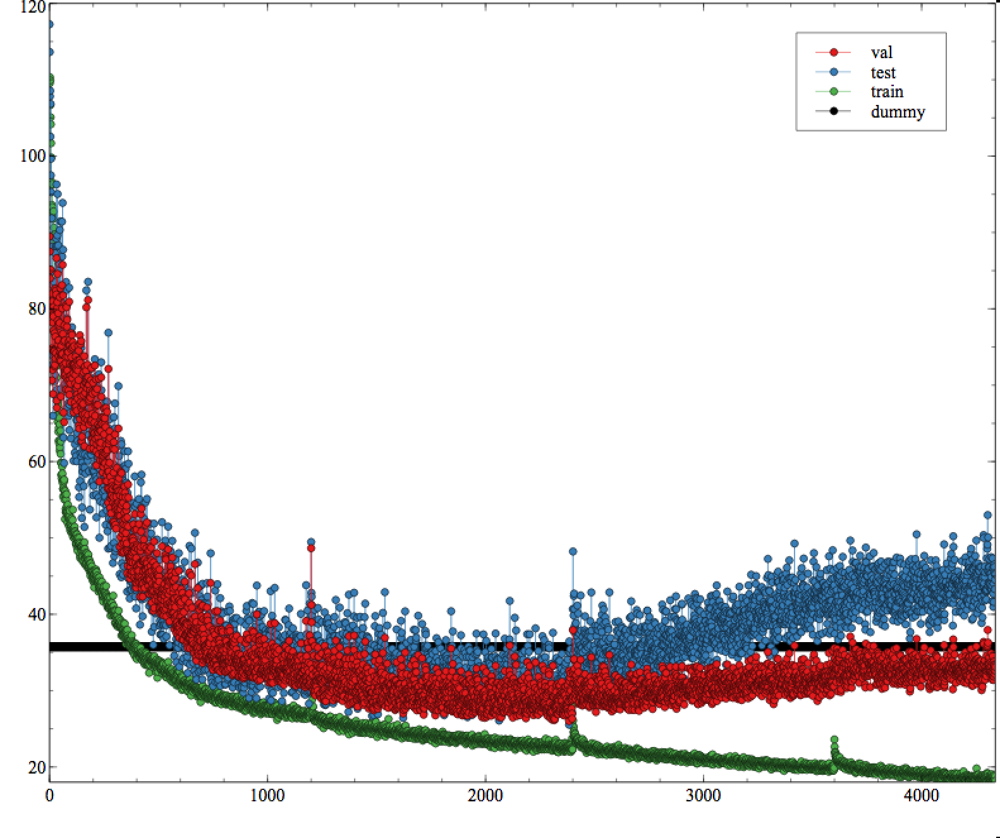

# Deep Learning Stock Volatility with Google Domestic Trends
Tensorflow/Keras implementation of the paper https://arxiv.org/pdf/1512.04916.pdf

<p align="center">
  <br/>
  <i>Trend displayed in Google Domestic Trends</i>
</p>

## Status?

Work accomplished so far:
- [x] End-to-end implementation
- [x] Test the data workflow pipeline
- [x] Sanity check of the model 
- [x] Train the models 

## Plot

<p align="center">
  <br/>
  <i>A new predictor is added every 600 epochs.</i>
</p>

At 600 epochs, the second predictor is added. At 1200, the third, 1800 the fourth, 2400 the fifth.

We realize that we start to overfit after more than 5 predictors. The dataset is indeed incredibly small.

## How to run it?
```
git clone https://github.com/philipperemy/stock-volatility-google-trends.git svgt
cd svgt
pip3 install -r requirements.txt
python3 run_model.py
```
